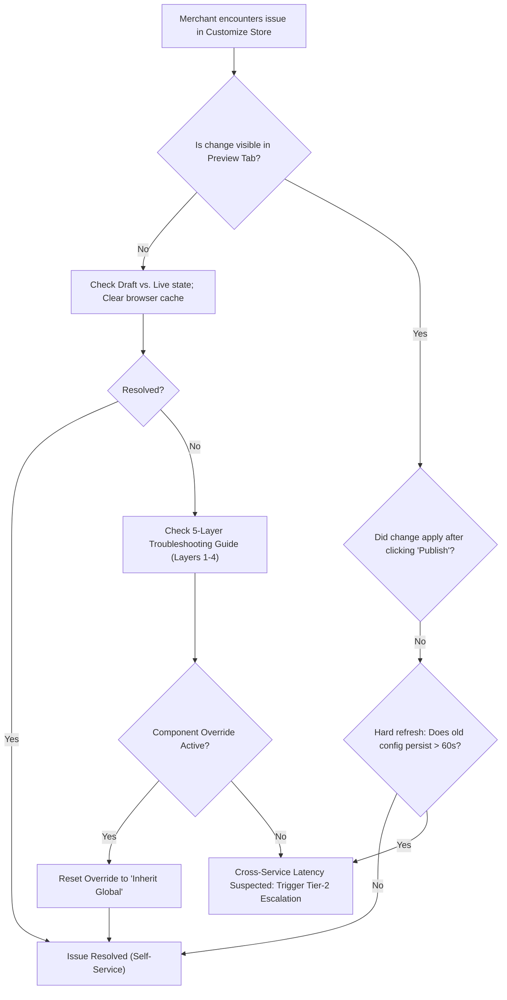

# Proof 5 — Trovéa Customize Store Knowledge Base & Troubleshooting Architecture

**Proof Class:** SELF-DIRECTED  
**Capability:** Technical Documentation, Knowledge Base Architecture, Tier-1 Ticket Deflection, Cross-Service Troubleshooting  
**Job Door:** Documentation & Knowledge Operations  
**Proof ID:** WOS-DOC-005  

---

## 1. Executive Summary & Problem

Merchants using Trovéa v2 frequently reported frustration when customizing their storefronts: theme changes appeared not to save, custom typography pairings failed silently, or switching accent tones unexpectedly broke color contrast across checkout and product card components. 

Rather than creating a flat list of reactive FAQs, I architected a **hierarchical self-service knowledge base** organized around Trovéa’s 5-layer customization engine:
$$\text{Layer 1: Theme Presets} \longrightarrow \text{Layer 2: Color Foundation} \longrightarrow \text{Layer 3: Accent Tone} \longrightarrow \text{Layer 4: Typography} \longrightarrow \text{Layer 5: Motion Systems}$$

This knowledge base serves a dual operational purpose:
1. **Merchant Self-Service Deflection:** Step-by-step resolution paths for configuration conflicts that can be resolved in the dashboard.
2. **Deterministic Tier-2 Escalation Protocol:** Precise diagnostic triggers that distinguish between merchant configuration error and cross-service caching anomalies (directly bridging to [Proof 3: Deliberately Broken Integration Investigation](../../01-support-technical-ops/incident-investigation/)).

---

## 2. Frequently Asked Questions (Top Deflection Targets)

### FAQ 01: "Why didn't my theme change save when I clicked Publish?"
* **Direct Cause:** In 85% of dashboard cases, theme changes fail to reflect immediately because of either (a) draft vs. live state mismatches or (b) browser service-worker caching on local preview sessions.
* **Immediate Fix:**
  1. Check the top status pill in your dashboard: if it says `Draft (Unpublished Changes)`, click **Publish to Live**.
  2. Perform a bypass cache refresh (`Ctrl + F5` on Windows/Linux, `Cmd + Shift + R` on macOS).
  3. Verify whether preview mode is active in another open tab; active preview sessions lock draft state until closed.
* **Escalation Trigger:** If the dashboard reports `Status: Published (Config v118)` but the live storefront continues rendering the old theme for longer than 60 seconds across multiple devices, this indicates an edge-cache propagation delay. See [Layer 1 Troubleshooting](#layer-1-theme-presets--layout-scaffolding) and [Escalation Path](#5-tier-2tier-3-engineering-escalation-path).

---

### FAQ 02: "Which typography options are compatible with each theme?"
* **Rule:** Trovéa enforces typographic cohesion to guarantee legibility and layout integrity across viewport sizes. Not every font family is available on every theme preset.
* **Theme Compatibility Matrix:**

| Theme Preset | Primary Headings | Body Copy | Monospace / Metadata | Accent Fallback |
| :--- | :--- | :--- | :--- | :--- |
| **Editorial Minimal** | Playfair Serif Display | Inter Sans (400/500) | JetBrains Mono | Times Roman |
| **Vibrant Modern** | Plus Jakarta Sans (Bold) | Plus Jakarta Sans | Fira Code | Helvetica Neue |
| **Monolith Utility** | Space Grotesk | IBM Plex Sans | Space Mono | Arial |
| **Atelier Craft** | Cormorant Garamond | Spectral | Courier Prime | Georgia |

* **Important Restriction:** When switching from *Editorial Minimal* to *Vibrant Modern*, custom serif display headings automatically convert to *Plus Jakarta Sans Bold* to avoid visual clipping on hero cards.

---

### FAQ 03: "How do I switch Accent Tone without overwriting my custom brand colors?"
* **Explanation:** Trovéa separates **Base Palette** (Background, Surface, Text) from **Accent Tone** (Call-to-Action buttons, badges, highlights).
* **Safe Workflow:**
  1. Navigate to **Customize Store > Color Foundation**. Verify that your Primary Brand Hex is locked (lock icon toggled ON).
  2. Navigate to **Accent Tone** and select between `High Contrast`, `Harmonic Muted`, or `Monochromatic`.
  3. The engine recalculates button background and hover tokens using WCAG 2.1 AA luminance ratios against your locked surface colors without altering your core background hex.

---

## 3. The 5-Layer Troubleshooting Guide

```
TROVÉA CUSTOMIZATION SYSTEM HIERARCHY
┌─────────────────────────────────────────────────────────┐
│ Layer 1: THEME PRESET (Scaffolding & Grid Layout)       │
├─────────────────────────────────────────────────────────┤
│ Layer 2: COLOR FOUNDATION (Background, Surface, Text)   │
├─────────────────────────────────────────────────────────┤
│ Layer 3: ACCENT TONE (CTA, Badges, Hover Dynamics)      │
├─────────────────────────────────────────────────────────┤
│ Layer 4: TYPOGRAPHY (Font Pairings, Weights, Scales)   │
├─────────────────────────────────────────────────────────┤
│ Layer 5: MOTION & MICRO-INTERACTIONS (Transitions)      │
└─────────────────────────────────────────────────────────┘
```

### Layer 1: Theme Presets & Layout Scaffolding
* **Symptom:** Selecting a new theme resets custom component arrangements.
* **Diagnostic Logic:** Themes in Trovéa are not just CSS skins; they define grid layout schemas and component slots. Switching themes moves unsupported modules into the "Hidden Components" tray.
* **Resolution Steps:**
  1. Open the left sidebar **Layout Tree**.
  2. Scroll down to **Inactive / Unmapped Components**.
  3. Drag existing product reels or promo banners back into the designated slots of the new theme.

### Layer 2: Color Foundation
* **Symptom:** Text appears low-contrast or washed out against dark backgrounds.
* **Diagnostic Logic:** Trovéa calculates minimum contrast ratios (4.5:1 for standard text, 3:1 for large display). If a custom hex violates WCAG standards, the engine displays an amber warning badge.
* **Resolution Steps:**
  1. Enter **Colors > Surface & Text**.
  2. If the warning icon `⚠️ Contrast Alert` appears, toggle **Auto-Adjust Contrast**.
  3. The system will shift the luminosity value by $\pm 12\%$ to reach accessibility thresholds while preserving your brand hue.

### Layer 3: Accent Tone
* **Symptom:** Buy button color does not change despite picking a new accent tone.
* **Diagnostic Logic:** Merchant has set a manual component-level color override inside the Product Details Page (PDP) template, which supersedes global accent tokens.
* **Resolution Steps:**
  1. Navigate to **Templates > Product Page > Buy Button**.
  2. Check **Color Source**: if set to *Custom Hex Override*, change it to *Inherit from Global Accent Tone*.
  3. Click **Apply to All Products**.

### Layer 4: Typography
* **Symptom:** Font switches back to default system font (Times New Roman or Arial) on mobile Safari.
* **Diagnostic Logic:** Web font asset failed to load within the 3000ms browser font-display timeout, triggering the fallback stack.
* **Resolution Steps:**
  1. Under **Customize Store > Typography**, verify **Font Loading Strategy** is set to `Preload Critical Fonts`.
  2. Disable custom `@font-face` external CSS imports from untrusted CDNs.
  3. Re-save the typography profile to bundle font files directly through Trovéa's CDN.

### Layer 5: Motion Systems
* **Symptom:** Cart drawer or image carousel animation stutters or fails to trigger.
* **Diagnostic Logic:** User device has OS-level `prefers-reduced-motion` enabled, or the store motion setting is configured to `Instant Cut`.
* **Resolution Steps:**
  1. Navigate to **Customize Store > Motion**.
  2. Verify that **Motion Mode** is set to `Smooth Spring` rather than `Instant`.
  3. Note: If the customer's operating system has reduced motion enabled, Trovéa deliberately overrides animations to standard fades to ensure accessibility compliance.

---

## 4. Merchant Self-Service Flowchart



---

## 5. Tier-2/Tier-3 Engineering Escalation Path

When self-service troubleshooting steps are exhausted, the issue must be escalated with structured telemetry. This protocol ensures support engineers can immediately distinguish between client-side state issues and distributed backend race conditions.

### The Diagnostic Triage Test
1. **Fetch Config Directly via API:**
   Run cURL against the merchant store's public endpoint:
   ```bash
   curl -I https://stores.trovea.app/{store_slug}/theme.css
   ```
2. **Inspect Response Headers:**
   * Look for `x-config-version` and `x-cache-status`.
   * If `x-config-version` is less than the dashboard version (e.g. Dashboard shows `v118`, header shows `v117`), this is a **Storefront-Render Cache Invalidation Delay**.
3. **Escalation Bridge:**
   * Reference Ticket: **[Proof 3: Deliberately Broken Integration Investigation](../../01-support-technical-ops/incident-investigation/)**.
   * Copy the merchant `store_id`, `config_version`, and cURL trace into the Engineering Handoff Ticket template.
   * Internal routing tag: `#eng-storefront-render-cache`.

---

## 6. What I Learned & Operational Impact

1. **Information Architecture Shapes Ticket Volume:** Unstructured support documents lead to high bounce rates and immediate ticket creation. Structuring troubleshooting by systemic execution order (Theme → Color → Accent → Typography → Motion) gives users an intuitive diagnostic ladder.
2. **KB as an Engineering Contract:** A first-rate knowledge base does not stop at answering simple questions. It explicitly defines the boundary where customer action ends and system failure begins, creating clean, reproducible handoffs that save engineering hours.
