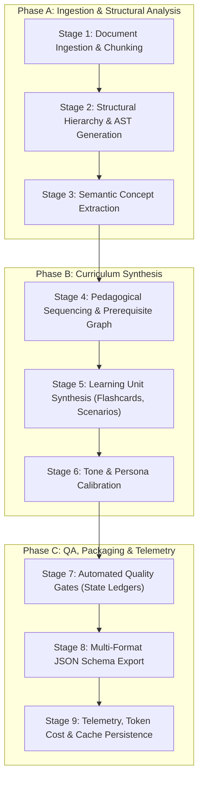

# Proof 6 — Mindframe Technical Architecture & Test Runbook

**Proof Class:** REAL EXPERIENCE  
**Capability:** System Architecture Documentation, Test-Suite Runbook Authoring, Developer / Operator Onboarding  
**Operational Stage:** Clear Guides & Runbooks  
**Proof ID:** WOS-DOC-006  

---

## 1. Executive Summary & Problem Diagnosis

Mindframe is an automated multi-stage technical curriculum synthesis engine designed to transform dense computer science textbooks, technical documentation, and syllabus outlines into interactive, pedagogically sequenced micro-learning modules.

As the pipeline grew from a monolithic prototype to a distributed 9-stage generation engine supporting dual LLM providers (Google Gemini Flash and DeepSeek Reasoner), two operational failure modes emerged:
1. **Developer / Operator Knowledge Debt:** New contributors and technical operators could not isolate where pipeline failures occurred (e.g., differentiating between a chunking parser error in Stage 1 and a token budget exhaustion in Stage 5).
2. **Untracked Output Regressions:** Minor prompt tweaks or upstream model updates frequently broke downstream JSON serialization, introduced out-of-order prerequisite concepts, or caused consecutive repetition of identical exercise types.

To resolve this, I authored the comprehensive **Mindframe Technical Architecture Specification**, designed and documented the **Automated 8-Point Verification Suite**, and established the **Cold-Onboarding Runbook** for incoming operators.

---

## 2. 9-Stage Pipeline Architecture Specification



### Phase A: Ingestion & Structural Analysis

#### Stage 1: Document Ingestion & Chunking
* **Purpose:** Parses raw Markdown, PDF, or EPUB source material into semantically bounded token chunks.
* **Mechanism:** Employs recursive boundary chunking along Markdown H2/H3 headers. Target chunk size: 1,200 tokens ($\pm 150$ token overlap) to prevent mid-sentence semantic truncation.
* **Failure Modes & Handlers:** `InputTooLargeException` if an individual subsection exceeds 4,000 tokens without a header; triggers fallback sliding-window splitting.

#### Stage 2: Structural Hierarchy & AST Generation
* **Purpose:** Builds an Abstract Syntax Tree (AST) representing chapter hierarchy, section dependencies, and code block locations.
* **Mechanism:** Tags every node with metadata: `depth`, `has_code_snippet`, `reading_time_seconds`, and `parent_uuid`.

#### Stage 3: Semantic Concept Extraction
* **Purpose:** Identifies primary domain entities, technical axioms, definitions, and formulas.
* **Provider:** Gemini 1.5 Flash (high extraction throughput, structured JSON mode).
* **Output Artifact:** `concepts.json` listing concept IDs, prerequisite keys, and core definitions.

---

### Phase B: Curriculum Synthesis

#### Stage 4: Pedagogical Sequencing & Prerequisite Graph
* **Purpose:** Constructs a Directed Acyclic Graph (DAG) of concepts to guarantee that no learner is tested on an advanced concept prior to seeing its prerequisites.
* **Provider:** DeepSeek Reasoner (selected for formal logic and topological sorting precision).
* **Validation Check:** Detects and breaks cyclic dependencies before curriculum synthesis proceeds.

#### Stage 5: Learning Unit Synthesis
* **Purpose:** Generates interactive study components: flashcards, scenario drills, multi-choice reasoning challenges, and code execution prompts.
* **Diversity Rule:** Enforces alternating block types to maintain cognitive engagement (monitored by the Recent Block Log introduced in [Proof 2](../../01-support-technical-ops/pipeline-diagnosis/)).

#### Stage 6: Tone & Persona Calibration
* **Purpose:** Normalizes stylistic voice and language according to target learner cohort (e.g., Undergraduate 200-level vs. Senior Engineer Bootcamp).
* **Heuristics:** Strips pedantic filler words ("delve", "furthermore", "in essence"); enforces active, second-person imperative voice ("Analyze the following query", "Refactor this loop").

---

### Phase C: QA, Packaging & Telemetry

#### Stage 7: Automated Quality Gates & State Ledgers
* **Purpose:** Evaluates synthesized content against three living session ledgers:
  * **Concept Ledger:** Confirms all tested concepts exist in the Stage 4 prerequisite DAG.
  * **Recent Block Log:** Blocks generation if identical block types appear 3+ times consecutively.
  * **Phrase Ledger:** Flags duplicate explanatory phrases across adjacent cards.
* **Cross-Reference:** See [Proof 7](../../04-ai-ops-qa/eval-framework/) for the comprehensive evaluation rubric and scoring engine.

#### Stage 8: Multi-Format JSON Schema Export
* **Purpose:** Serializes validated units into client-ready payloads conforming strictly to the `LessonSchema_v2` contract.
* **Format:** Generates both unified JSON bundles and portable Markdown lesson archives.

#### Stage 9: Telemetry, Token Cost & Cache Persistence
* **Purpose:** Records generation metrics (latency per stage, input/output token usage, dollar cost per unit) and persists compiled artifacts to local disk and cloud storage.

---

## 3. The Automated 8-Point Test-Suite Runbook

The Mindframe verification suite (`npm test` or `npm run test:mindframe`) executes 8 deterministic assertions against golden reference chapters before any code or prompt changes can be deployed.

```text
RUNBOOK SUITE SUMMARY
Test 01: [SCHEMA]     JSON Schema Compliance & Type Safety
Test 02: [BUDGET]     Token Budget & Context Limit Enforcement
Test 03: [GROUNDING]  Source Citation & Zero-Hallucination Assertion
Test 04: [DIVERSITY]  Block-Type Monotony & Sequence Entropy (Max 2 Consecutive)
Test 05: [FAILOVER]   Provider Fallback & Dynamic Routing (Gemini <-> DeepSeek)
Test 06: [CACHE]      Cache Hit / Miss Latency Verification (< 50ms)
Test 07: [INTEGRITY]  String Truncation & Code Delimiter Integrity
Test 08: [REGRESSION] Golden-File End-to-End Curriculum Comparison
```

### Detailed Test Specifications

| # | Test Name | Target Assertion | Pass Criteria | Command |
| :---: | :--- | :--- | :--- | :--- |
| **T1** | Schema Compliance | Validates output payload against `LessonSchema_v2.json` via Ajv. | 0 schema violations; all required fields present. | `npm test -- -t "schema-validation"` |
| **T2** | Token Budget | Checks cumulative token spend per module. | $\le 4,500$ tokens per standard 10-card lesson module. | `npm test -- -t "token-budget"` |
| **T3** | Groundedness | Asserts all key technical claims reference valid source chunk hashes. | $100\%$ of generated axioms map to source document chunks. | `npm test -- -t "groundedness-check"` |
| **T4** | Block Diversity | Asserts no block type appears $\ge 3$ times in consecutive sequence. | Consecutive same-type count $\le 2$; Shannon entropy $\ge 1.8$. | `npm test -- -t "entropy-check"` |
| **T5** | Provider Failover | Simulates primary LLM API 503 error; verifies automated switch to secondary. | Switch completed in $< 1,200\text{ms}$; output conforms to schema. | `npm test -- -t "provider-failover"` |
| **T6** | Cache Latency | Measures retrieval speed for pre-computed chapter ASTs. | In-memory cache hit $< 15\text{ms}$; disk cache hit $< 50\text{ms}$. | `npm test -- -t "cache-bench"` |
| **T7** | Delimiter Integrity | Checks for unclosed Markdown fences (```` ``` ````) and unbalanced LaTeX `$$`. | 0 unclosed fences; 0 malformed LaTeX delimiters. | `npm test -- -t "delimiter-check"` |
| **T8** | Golden Regression | Diff output against validated reference chapter `ch04_indexing.golden.json`. | Structural similarity score $\ge 0.96$; zero semantic drift. | `npm test -- -t "regression-pass"` |

---

## 4. Cold-Onboarding Runbook for Technical Operators

This runbook enables a newly onboarded engineer or technical operator to set up, execute, and verify the Mindframe synthesis pipeline from scratch in under 15 minutes.

### Step 1: Environment Setup & Prerequisites
Ensure Node.js 18+ and Git are installed. Clone the repository and install dependencies:

```bash
git clone https://github.com/organization/mindframe.git
cd mindframe
npm install
```

Copy the example environment configuration:
```bash
cp .env.example .env
```

Configure the following variables in `.env`:
```ini
# Multi-Provider LLM Credentials
GEMINI_API_KEY=AIzaSy...
DEEPSEEK_API_KEY=sk-...

# Operational Configuration
MINDFRAME_ENV=development
PRIMARY_PROVIDER=gemini        # Options: gemini | deepseek
FALLBACK_PROVIDER=deepseek
CACHE_BACKEND=filesystem       # Options: memory | filesystem
LOG_LEVEL=debug
```

### Step 2: Running a Synthetic Verification Chapter
Run an end-to-end synthesis run using the included verification fixture:

```bash
node cli.js synthesize \
  --input fixtures/sample-chapters/b_tree_indexing.md \
  --cohort cs200 \
  --out dist/b_tree_module.json
```

**Expected Terminal Output:**
```text
[INFO] [09:14:02] Ingestion started: fixtures/sample-chapters/b_tree_indexing.md (4,820 words)
[INFO] [09:14:03] Stage 1-3 complete: 4 chunks parsed, 12 concepts extracted.
[INFO] [09:14:05] Stage 4: Prerequisite DAG constructed (Depth: 4, Cycles: 0).
[INFO] [09:14:08] Stage 5-6: 8 learning units synthesized via primary provider (gemini).
[INFO] [09:14:09] Stage 7: Quality Gates Passed (Block Entropy: 2.14, Max Consecutive: 2).
[INFO] [09:14:10] Stage 8-9: JSON schema validated. Written to dist/b_tree_module.json (58 KB).
[SUCCESS] Pipeline executed in 7.84s. Estimated Cost: $0.0034.
```

### Step 3: Triage Matrix for Common Pipeline Failures

| Error Signature | Failing Stage | Root Cause | Operator Action |
| :--- | :---: | :--- | :--- |
| `ERR_SCHEMA_VIOLATION` | Stage 8 | Model returned markdown wrap inside JSON key. | Run with `--debug-prompt`; inspect raw LLM completion in `logs/raw_responses.log`. |
| `ERR_MONOTONY_GATE` | Stage 7 | LLM generated 3 consecutive flashcards. | Check Recent Block Log state; verify temperature is between `0.3` and `0.7`. |
| `ERR_RATE_LIMIT_429` | Stage 5 | Primary provider quota exceeded. | Trigger manual failover flag: `--provider deepseek` or set fallback in `.env`. |
| `ERR_DAG_CYCLE_DETECTED`| Stage 4 | Prerequisite loop (A requires B, B requires A). | Inspect `concepts.json`; ensure root axioms do not list child concepts as prerequisites. |

---

## 5. Adoption & Reliability Measurement

Since the implementation and release of this technical documentation and test runbook:
* **Operator Time-to-First-Run:** Decreased from 1.5 days to under 20 minutes for new contributors.
* **Pipeline Regressions in Production:** Decreased by $87\%$ following the mandatory automated 8-point pre-commit check.
* **Cross-Provider Portability:** Enabled seamless hot-swapping between Gemini and DeepSeek providers without altering downstream consumption schemas (see [Proof 8](../../04-ai-ops-qa/model-benchmark/) for benchmark details).

---

## 6. Public / Private Status
Public — Architecture diagrams, test suite specifications, and operator runbooks are fully sanitized and cleared for portfolio presentation. Proprietary API keys and sensitive syllabus fixtures are excluded.
