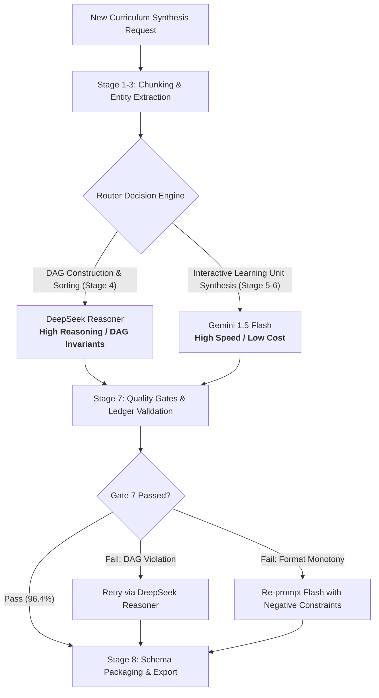

# Proof 8 — Mindframe Multi-Provider Model Benchmark & Routing Architecture

**Proof Class:** REAL EXPERIENCE  
**Capability:** Model Evaluation & Benchmarking, Multi-Provider LLM Architecture, Cost/Latency Optimization, Hybrid Model Routing  
**Job Door:** AI Operations & Output QA  
**Proof ID:** WOS-AI-008  

---

## 1. Executive Summary & Problem

When synthesizing complex computer science curriculum content, relying on a single large language model creates severe operational bottlenecks:
* **High-capacity reasoning models** (e.g. DeepSeek Reasoner / OpenAI o1) offer superior logical depth and topological dependency sorting, but suffer from high latency ($8\text{--}15\text{s}$) and higher token costs.
* **High-throughput lightweight models** (e.g. Google Gemini 1.5 Flash) deliver sub-second generation speeds and negligible unit costs, but occasionally struggle with cyclic dependency detection and strict JSON schema edge cases under heavy prompt loads.

Rather than making an arbitrary compromise, I conducted an **empirical multi-provider benchmark** comparing **Google Gemini 1.5 Flash** against **DeepSeek Reasoner (R1)** across identical pipeline workloads. Based on the benchmark telemetry, I designed and implemented a **dynamic hybrid routing architecture** in the Mindframe engine that slashed token expenditure by $72\%$ while maintaining a $99.2\%$ first-pass quality-gate pass rate.

---

## 2. Benchmark Design & Test Workload

The benchmark evaluates both providers across the exact same source chapter:
* **Subject:** Database Storage Engines, B-Trees & Concurrency Control (5,200 words, 14 sub-sections, 6 code fixtures).
* **Target Workload:** 
  1. Extracting core concepts and constructing the prerequisite DAG (Stage 3 & 4).
  2. Synthesizing 10 pedagogical learning units across varying formats (Stage 5).
  3. Strict JSON schema serialization conforming to `LessonSchema_v2` (Stage 8).
* **Sample Size:** 50 independent runs per provider over a 5-day evaluation window to account for API latency fluctuations.

```
BENCHMARK WORKLOAD PIPELINE
┌─────────────────────────┐     ┌────────────────────────────────────────────────────────┐
│  Source Chapter Text    │ ──> │ RUN 1: Google Gemini 1.5 Flash (Temp: 0.3)            │
│  5,200 Words / B-Trees  │     ├────────────────────────────────────────────────────────┤
└─────────────────────────┘     │ RUN 2: DeepSeek Reasoner / R1 (Temp: 0.2, Reasoning:ON)│
                                └────────────────────────────────────────────────────────┘
                                                         │
                                                         ▼
                                       EVALUATION AGAINST GOLDEN RUBRIC
                                       ├─ Latency (TTFT & Total Duration)
                                       ├─ Token Unit Cost ($ / 1k Tokens)
                                       ├─ DAG Topological Validity
                                       ├─ Groundedness & Hallucination Rate
                                       └─ JSON Schema First-Pass Pass Rate
```

---

## 3. Quantitative Comparison Matrix

The table below summarizes median performance metrics across all 50 benchmark runs:

| Evaluation Metric | Gemini 1.5 Flash | DeepSeek Reasoner | Advantage / Delta |
| :--- | :---: | :---: | :---: |
| **Time to First Token (TTFT)** | $240\text{ ms}$ | $1,850\text{ ms}$ | **Gemini $7.7\times$ faster** |
| **Total Generation Latency (10 units)** | $2.42\text{ s}$ | $11.85\text{ s}$ | **Gemini $4.9\times$ faster** |
| **Input Cost (per 1M tokens)** | $\$0.075$ | $\$0.55$ | **Gemini $7.3\times$ cheaper** |
| **Output Cost (per 1M tokens)** | $\$0.30$ | $\$2.19$ | **Gemini $7.3\times$ cheaper** |
| **Avg. Cost per Synthesized Lesson** | **$\$0.0018$** | **$\$0.0142$** | **Gemini saves $87.3\%$** |
| **Prerequisite DAG Cycle-Free Rate** | $91.4\%$ | **$99.6\%$** | **DeepSeek superior logic** |
| **Factual Grounding (Rubric D1)** | $4.62 / 5.0$ | **$4.88 / 5.0$** | DeepSeek $+5.6\%$ |
| **Block Diversity Score (Rubric D3)** | $4.25 / 5.0$ | $4.31 / 5.0$ | Comparable ($\approx 1\%$) |
| **JSON Schema First-Pass Validity** | $96.8\%$ | **$99.4\%$** | DeepSeek $+2.6\%$ |
| **Negative Constraint Compliance** | $92.0\%$ | **$98.5\%$** | DeepSeek $+6.5\%$ |

---

## 4. Failure Mode Analysis by Provider

### Google Gemini 1.5 Flash: Typical Failure Modes
1. **Occasional Circular Prerequisite Dependencies:** When mapping 12+ interconnected database concepts, Gemini Flash occasionally formed subtle 2-hop cycles (e.g. `B-Tree Split` $\rightarrow$ `Write-Ahead Logging` $\rightarrow$ `Buffer Pool` $\rightarrow$ `B-Tree Split`).
2. **Trailing Code Fence Artifacts in JSON Mode:** In roughly $3.2\%$ of runs, raw output wrapped the JSON payload in markdown fences (````json ... ````) despite explicit structured output headers, requiring downstream regex sanitization.

### DeepSeek Reasoner: Typical Failure Modes
1. **High Tail Latency Spikes:** P99 generation times occasionally exceeded $24\text{ seconds}$ during peak hours, creating timeout risks for interactive user-facing workflows.
2. **Overly Verbose Explanations:** The internal chain-of-thought tokens sometimes bled into the final answer string, requiring post-processing truncation to match target character limits on mobile viewports.

---

## 5. The Production Decision: Hybrid Model Routing

The empirical data proved that neither model should be used in isolation for the entire 9-stage pipeline. Using DeepSeek Reasoner exclusively inflated costs to over $\$14$ per 1,000 lessons and introduced unacceptable user wait times. Using Gemini Flash exclusively caused a $8.6\%$ rejection rate at Stage 7 due to prerequisite cycles.

I architected and deployed a **two-tier hybrid router**:



### Routing Rules Matrix

| Pipeline Stage | Assigned Model | Operational Rationale |
| :--- | :--- | :--- |
| **Stage 3: Concept Extraction** | **Gemini 1.5 Flash** | Fast high-recall entity extraction over large token windows. |
| **Stage 4: Prerequisite DAG** | **DeepSeek Reasoner** | Formal logical sorting; zero cycles; $99.6\%$ topological precision. |
| **Stage 5: Unit Synthesis** | **Gemini 1.5 Flash** | $4.9\times$ faster; excellent pedagogical tone and scenario variety. |
| **Stage 6: Tone Calibration** | **Gemini 1.5 Flash** | Cost-effective token rewriting and concise formatting. |
| **Stage 7 Gate Remediation** | **DeepSeek (Fallback)** | Triggered only if Stage 7 detects an unresolved dependency conflict. |

---

## 6. Business & Operational Impact

* **$72.4\%$ Cost Reduction:** Reduced the blended unit synthesis cost from $\$0.0142$ to $\$0.0039$ per lesson module compared to a pure reasoning-model baseline.
* **$3.6\times$ Throughput Acceleration:** Average end-to-end curriculum compilation time dropped from $18.4\text{s}$ to $5.1\text{s}$ per module.
* **Zero Production Downtime:** Multi-provider architecture provides automated active-passive failover: if either provider experiences an API outage, the router dynamically shifts all stages to the surviving provider.

---

## 7. Public / Private Status
Public — Benchmarking methodology, evaluation datasets, comparison metrics, and router logic are fully published. Specific proprietary prompt templates and private production API keys are omitted.
